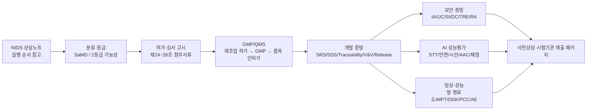

# Regulatory Master Map

작성일: 2026-05-08  
목적: 브레인프렌즈 인허가/품질/임상/개발 문서를 한 화면에서 보고, 다음 개발 작업이 어떤 가이드라인 요구사항을 막는지 확인한다.

## 1. 한 줄 결론

브레인프렌즈는 현재 `재활 보조 SaMD`로 잠그고, 2등급 가능성을 기준으로 `분류·등급 → 제24~26조 첨부서류 → GMP/QMS → 사이버보안 → AI 성능평가 → 마비말장애 임상지표` 증빙을 준비한다. DTx/치료효과 클레임은 확증임상 또는 식약처 인정 전까지 조건부 또는 금지로 유지한다.

2026-05-12 KTL 1차 미팅 이후 사업 실행 전략은 `1등급 정보 제공/훈련 보조 우선 신고 + 2등급 SaMD 장기 준비` 투트랙을 우선 검토한다. 개발팀 액션은 `ktl-meeting-developer-action-plan-2026-05-12.md`를 기준으로 관리한다.

제품 허가·인증·심사 관련 내부 기준은 `permit-readiness-internal-standard.md`에서 먼저 확인한다. 2등급 준비 상태와 개발 우선순위는 `class-2-samd-readiness-matrix.md`를 기준으로 관리하고, 제24조 제출자료 묶음은 `article-24-dossier-index.md`에서 관리한다.

## 2. 전체 흐름

## 3. 원문별 핵심 판단

| 원문 | 내부 문서 | 핵심 결론 | 아직 부족한 것 |
| --- | --- | --- | --- |
| NIDS 상담노트 | `source-nids-consultation-requirements.md` | NIDS는 제품 판정서가 아니라 실행 순서 참고. 제조업 허가 → GMP → 품목 인허가 순서로 준비 | 공식 질의 회신, 제조업/GMP 실제 착수 |
| 디지털의료기기 분류·등급 | `source-classification-grade-requirements.md` | 독립형 SaMD 후보, 2등급 가능성 기준, 치료·재활 축 보수 적용 | 제품코드 후보, 식약처/RA 확인 |
| 디지털의료제품 고시 제2026-4/5/6호 | `source-digital-medical-product-notice-2026-requirements.md` | 제24조 제출자료 8종, 제25조 면제·갈음 전략, 제26조 세부 작성요건을 2등급 SaMD 준비 기준에 연결 | 제24조 첨부서류 인덱스, 제25조 분석성능 검증셋, 제26조 anomaly/retest/impact |
| 디지털의료기기 GMP | `source-gmp-requirements.md` | 기능보다 품질기록이 중요. SRS/SDS/traceability/SOUP/SBOM/변경관리/릴리스 필요 | release manifest 확장, 문제보고/CAPA export |
| 사이버보안 | `source-cybersecurity-requirements.md` | 통신 경로가 있으므로 IA/UC/SI/DC/TRE/RA 체크리스트와 검증자료 필요 | 백업/복구, 권한표, 감사 실패 처리, 공급자/보존정책 |
| AI 허가·심사 | `mfds-ai-permit-review-response.md` | 성능, 학습/평가 데이터, 클라우드, 업데이트 주기, AI 역할 경계 필요 | 실측 WER/CER/RTF, 모델/알고리즘 사양표 |
| AI 임상시험계획 | `source-ai-clinical-stroke-requirements.md` | 후향적 AI 성능평가는 독립 시험셋, 참조표준, gold label, 통계계획, 데이터 보안이 필요 | locked test set, SLP gold label, 평가자 눈가림 |
| 마비말장애 DTx | `source-poststroke-dysarthria-dtx-requirements.md` | DTx 트랙은 말 명료도, MPT, DDK, PCC, PHQ-9, QoL-Dys, AE/순응도 필요 | 치료사 말 명료도 입력, 30개 단어 PCC, MPT/DDK 과제 |
| 사용적합성 | `usability-evaluation-protocol.md` | IEC 62366 형성/총괄 평가 계획은 있음 | 실제 formative/summative 수행 결과 |

## 4. 개발 우선순위 통합표

| 우선순위 | 작업 | 막는 요구사항 | 산출물 |
| --- | --- | --- | --- |
| P0-0 | 제24조 첨부서류 인덱스 작성 | NOTICE-024/025/026 | 사용목적, 개발경위, V&V, 임상/갈음, 보안, 사용성, 전문가용, 변경관리 링크 |
| P0-1 | 결과 저장/ZIP export 완전 고정 | NOTICE-025, NOTICE-026, CLASS-013~015, GMP-005, DYS-023~025 | audio, target, transcript, scoreReason, reviewRequired, app/model/doc version |
| P0-2 | release manifest를 GMP 출시기록으로 확장 | NOTICE-026, GMP-018~025 | git SHA, package-lock, SBOM, SOUP, 모델 버전, V&V 결과, 잔여위험 승인, anomaly/retest/impact |
| P0-3 | 문제보고/CAPA export | NOTICE-026, GMP-008, GMP-024, DYS-029~032 | 저장 실패, STT 실패, 채점 이상, 권한 거부, AE/ADE 문제보고 JSON/CSV |
| P0-4 | 치료사 검토 화면 강화 | NOTICE-025, NOTICE-026, CLASS-014~015, DYS-023~025 | 원음 재생, target/transcript 비교, 정오답, 말 명료도 0~100 입력 |
| P0-5 | 보안 증빙 gap 77% → 90%+ | NOTICE-026, CYBER-UC/TRE/DC/RA, GMP-026 | 권한표, 감사로그 접근통제, 백업/복구, 보존정책 |
| P1-1 | 마비말장애 평가세트 | DYS-023~028 | 30개 목표단어 PCC, MPT, DDK, baseline/4주/8주 구조 |
| P1-2 | AI/STT 성능평가 export | AI 허가·심사, AICLIN-001~035, GMP-027~029 | WER/CER/RTF, stratification, gold label, locked test set, 모델/알고리즘 사양표 |
| P1-3 | clinical protocol outline | DYS-013~035 | 대상자, 선정/제외, 방문, endpoint, 안전성, 동의/보상 초안 |

## 5. 지금 봐야 할 문서 순서

1. `permit-readiness-internal-standard.md` — 허가 준비 내부 기준서. 개발/문서 갱신 때 계속 보는 단일 기준
2. `ktl-meeting-developer-action-plan-2026-05-12.md` — KTL 미팅 후 개발자가 해야 할 작업
3. `regulatory-master-map.md` — 전체 지도
4. `class-2-samd-readiness-matrix.md` — 2등급 SaMD 기준으로 무엇이 됐고 무엇이 부족한지
5. `article-24-dossier-index.md` — 제24조 첨부서류 8종별 내부 산출물/코드 증적/부족 항목
6. `source-digital-medical-product-notice-2026-requirements.md` — 제24~26조 허가 제출자료와 2등급 갈음 전략
7. `source-classification-grade-requirements.md` — 왜 SaMD/2등급 가능성인지
8. `source-gmp-requirements.md` — 품질·릴리스·형상관리로 무엇을 남겨야 하는지
9. `source-poststroke-dysarthria-dtx-requirements.md` — 마비말장애 DTx로 갈 때 어떤 임상지표가 필요한지
10. `source-ai-clinical-stroke-requirements.md` — AI 성능평가용 후향적 데이터셋을 어떻게 잠글지
11. `test-and-certification-development-guide.md` — 개발팀이 당장 고칠 항목
12. `claim-lock.md` — 회사/외부에 말해도 되는 문구와 금지 문구

## 6. PM 결정

다음 개발은 새 기능보다 증빙 구조 고정이 우선이다.

첫 작업은 `제24조 첨부서류 인덱스 + release manifest + 결과 ZIP + 문제보고/CAPA export`를 하나의 시험 증빙 흐름으로 묶는 것이다. 이 작업이 끝나야 분류·등급, GMP, 사이버보안, DTx 임상지표가 코드 산출물과 연결된다.
